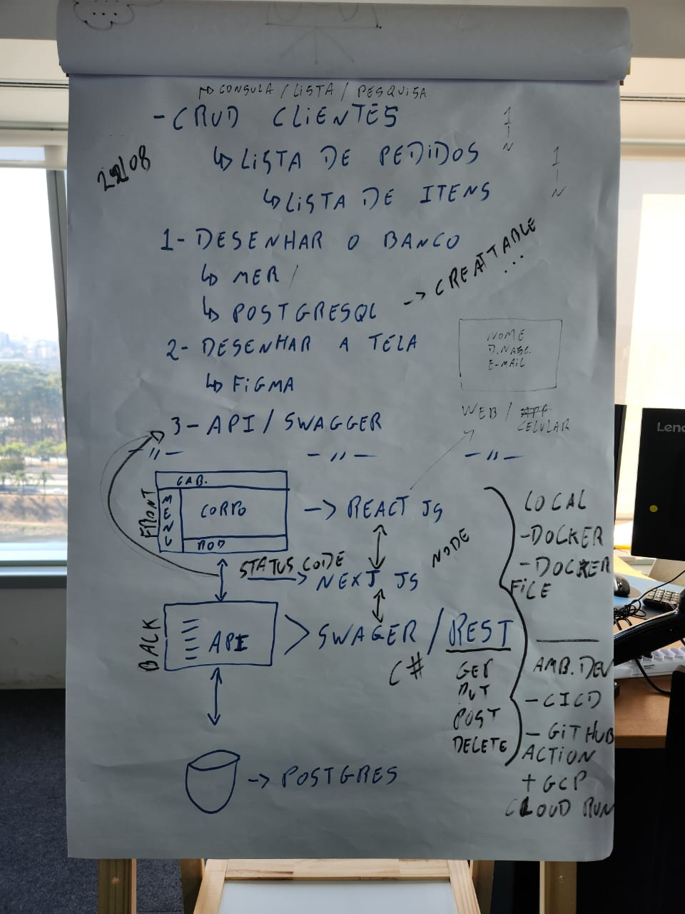
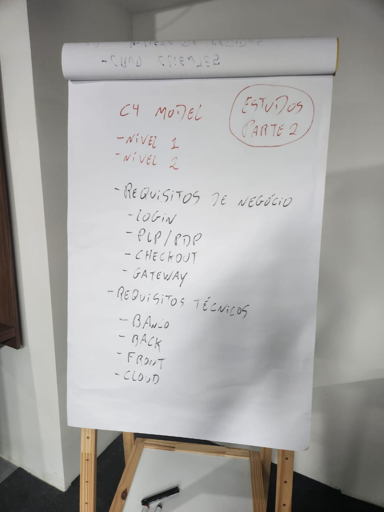
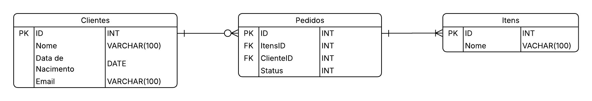

# GiftUp - Sistema de E-commerce


## 📋 Sobre o Projeto

O **GiftUp** é uma aplicação completa de e-commerce desenvolvida para aprendizado seguindo as orientações de um desafio em duas partes (até 17/09), oferecendo uma plataforma para venda de produtos de presentes. O sistema é composto por uma API RESTful em .NET 8 e um frontend em React. Projeto ainda está em desenvolvimento.

Parte 1:



Parte 2:



## Documentos Parte 1:

- DER do banco de dados no LucidApp:

    [DER GiftUp](https://lucid.app/lucidchart/a03c70d2-d515-4af4-9074-fc511bf5d1e8/edit?invitationId=inv_2b6ebada-9857-4f41-b3bd-aa3fd288765f&page=0_0#)

    

- Prototipação das telas no Figma:

    [Figma GiftUp](https://lucid.app/lucidchart/a03c70d2-d515-4af4-9074-fc511bf5d1e8/edit?viewport_loc=-1008%2C-181%2C2510%2C1117%2C0_0&invitationId=inv_2b6ebada-9857-4f41-b3bd-aa3fd288765f)


## ✨ Funcionalidades

### 🔐 Autenticação e Autorização
- Sistema de login e registro de usuários
- Autenticação JWT (JSON Web Tokens)
- Criptografia de senhas com BCrypt

### 🛍️ Gestão de Produtos
- CRUD completo de produtos
- Upload e gerenciamento de imagens
- PDP e PLP

### 🛒 Sistema de Pedidos
- Carrinho de compras funcional (adição e remoção de itens, e alteração da quantidade deles por pedido)

### 👤 Gestão de Usuários
- Perfil do usuário
- Dados pessoais

## 🏗️ Arquitetura

### Backend (.NET 8)
- **API RESTful** com ASP.NET Core
- **PostgreSQL** banco de dados
- **JWT** para autenticação
- **Swagger** para documentação da API
- **Docker** para containerização
- **Repository Pattern** para acesso a dados

### Frontend (React 19)
- **React/Vite** com hooks modernos
- **Axios** para requisições HTTP na API
- **Responsive Design** para mobile e desktop

### Infraestrutura
- **Google Cloud Run** para deploy
- **PostgreSQL** hospedado na nuvem
- **Docker** para containerização
- **Nginx** como servidor web para o frontend

## 🚀 Tecnologias Utilizadas

### Backend
- [.NET 8](https://dotnet.microsoft.com/)
- [ASP.NET Core](https://docs.microsoft.com/en-us/aspnet/core/)
- [PostgreSQL](https://www.postgresql.org/)
- [Npgsql](https://www.npgsql.org/)
- [JWT Bearer](https://jwt.io/)
- [BCrypt.Net](https://github.com/BcryptNet/bcrypt.net)
- [Swagger/OpenAPI](https://swagger.io/)

### Frontend
- [React 19](https://reactjs.org/)
- [Vite](https://vitejs.dev/)
- [Axios](https://axios-http.com/)
- [Lucide React](https://lucide.dev/)
- [ESLint](https://eslint.org/)

### Container & Deploy
- [Docker](https://www.docker.com/)
- [Google Cloud Run](https://cloud.google.com/run)


## 🛠️ Instalação e Configuração

### Pré-requisitos
- [.NET 8 SDK](https://dotnet.microsoft.com/download)
- [Node.js](https://nodejs.org/)
- [PostgreSQL](https://www.postgresql.org/)
- [Docker](https://www.docker.com/)
- [Nginx](https://nginx.org/)

### 1. Clone o repositório
```bash
git clone https://github.com/seu-usuario/APIGiftup.git
cd APIGiftup
```

### 2. Configuração do Backend

```bash
cd APICRUD

# Restaurar dependências
dotnet restore

# Configurar string de conexão no appsettings.json
# "ConnectionStrings": {
#   "DefaultConnection": "Host=localhost;Database=giftup;Username=seu_usuario;Password=sua_senha"
# }

# Executar migrações (se necessário)
# dotnet ef database update

# Executar a aplicação
dotnet run
```

### 3. Configuração do Frontend

```bash
cd giftup-frontend

# Instalar dependências
npm install

# Configurar URL da API no .env
echo "VITE_API_URL=http://localhost:5000" > .env

# Executar em modo desenvolvimento
npm run dev
```

### 4. Configuração do Banco de Dados

```sql
-- Execute o script create-tables-now.sql no PostgreSQL
psql -U seu_usuario -d giftup -f create-tables-now.sql
```

## 🐳 Deploy com Docker

### Backend
```bash
cd APICRUD
docker build -t giftup-api .
docker run -p 5000:8080 giftup-api
```

### Frontend
```bash
cd giftup-frontend
docker build -t giftup-frontend .
docker run -p 3000:8080 giftup-frontend
```

## 📚 Documentação da API

A API está documentada com Swagger que pode ser acessado em:
- [swagger](https://giftup-api-12260072068.us-central1.run.app/swagger/index.html)

#### O frontend (React) pode ser acessado em:

- [Frontend](https://giftup-frontend-12260072068.us-central1.run.app/)

### Principais Endpoints

#### Autenticação
- `POST /api/v1/cliente/register` - Registrar usuário
- `POST /api/v1/cliente/login` - Login
- `GET /api/v1/auth/check` - Verificar autenticação

#### Produtos
- `GET /api/v1/item` - Listar produtos
- `GET /api/v1/item/{id}` - Obter produto específico
- `POST /api/v1/item` - Criar produto (admin)
- `PUT /api/v1/item/{id}` - Atualizar produto (admin)
- `DELETE /api/v1/item/{id}` - Deletar produto (admin)

#### Pedidos
- `GET /api/v1/pedido` - Listar pedidos do usuário
- `POST /api/v1/pedido` - Criar pedido
- `PUT /api/v1/pedido/{id}` - Atualizar pedido

## 🔧 Configuração de Ambiente

### Variáveis de Ambiente

#### Backend (.NET)
```json
{
  "ConnectionStrings": {
    "DefaultConnection": "Host=localhost;Database=giftup;Username=usuario;Password=senha"
  },
  "Jwt": {
    "Key": "sua-chave-secreta-jwt",
    "Issuer": "GiftUp",
    "Audience": "GiftUpUsers"
  }
}
```

## 🧪 Testes

```bash
# Backend
cd APICRUD
dotnet test

# Frontend
cd giftup-frontend
npm test
```

## 📱 Screenshots

### Página Inicial


### Carrinho de Compras


### Pagina de Administrador


## 🤝 Contribuição

1. Fork o projeto
2. Crie uma branch para sua feature (`git checkout -b feature/AmazingFeature`)
3. Commit suas mudanças (`git commit -m 'Add some AmazingFeature'`)
4. Push para a branch (`git push origin feature/AmazingFeature`)
5. Abra um Pull Request

## 👥 Autor

- **Nicolas Pires** - *Desenvolvimento* - [@Pires3108](https://github.com/Pires3108)

## 🙏 Agradecimentos

- **Land IT** - Empresa que propôs o desafio e em que eu trabalho
- **Jessé** - pessoa que propuseram e orientou a como fazer o projeto

## 📞 Contato

- [](https://www.linkedin.com/in/nicolas-pires-sim%C3%A3o-4a4146218/)
